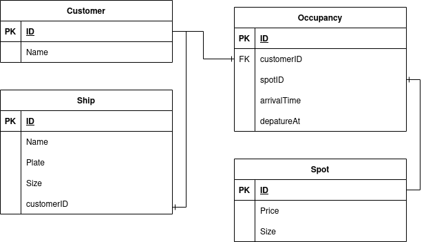

# Documentation

## Diagram

Use this file to fill in your documentation

## 2021-03-17

First day in project. We talked about our ideas and then we create many tasks to do to the project.Created a model (class) of the user, Consol GUI/Menu to develop the console menus & interfaces (user-perspective).

## 2021-03-18
We done many tasks which we created for project. 

## 2021-03-22

We created another tasks for the our project, database migration to Migrate/sync data with actual database upon application launch and reading from database to read data from database to determine which users are currently parked e.t.c.

## 2021-03-23

We created Generate a simple invoice that should be displayed whenever the user exits their parking. The invoice should contain information such as started time, end time, total time parked, total cost and cost per hour.

## 2021-03-24

